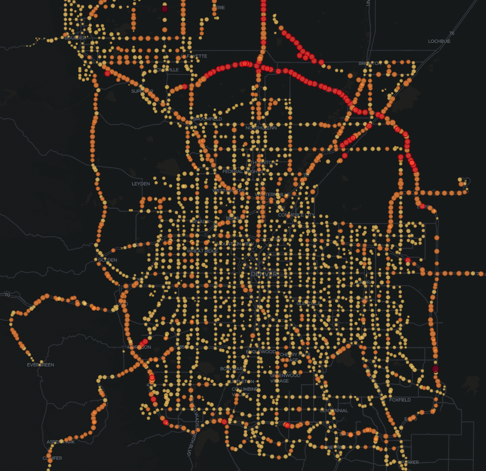

# RTD Bus Feed

The __rtd-feed__ module publishes the latest Denver RTD vehicle positions, every 30 seconds, to the `rtd-bus-position` Kafka topic.

The messages are serialized as Avro and look like this:

    {
      "id": "985CC5EC1D3FC176E053DD4D1FAC4E39",
      "timestamp": 1574904869,
      "location": {
        "lon": -104.98970794677734,
        "lat": 39.697723388671875
      },
      "milesPerHour": 0
    }

The message key is the vehicle ID, which means that telemetry for a vehicle is always sent to the same Kafka partition.

The __rtd-stream__ module is a Kafka Streams job that enriches the feed data with the speed, based on the distance traveled between the last known position. The enriched records are written to the `rtd-bus-postition-enriched` topic. Here's a sample record:

    {
      "id": "985CC5EC1D3FC176E053DD4D1FAC4E39",
      "timestamp": 1574904869,
      "location": {
        "lon": -104.98970794677734,
        "lat": 39.697723388671875
      },
      "milesPerHour": 34.18513011763098
    }

Note that the milesPerHour has been updated.

Once the enriched data is in Kafka, it can be written to Elastic using Kafka Connect. In order to recognise the timestamp and location using the proper datatypes, we create a dynamic template in Elastic:

    {
      "dynamic_templates": [
        {
          "dates": {
            "mapping": {
              "format": "epoch_millis",
              "type": "date"
            },
            "match": "*timestamp"
          }
        },
        {
          "locations": {
            "mapping": {
              "type": "geo_point"
            },
            "match": "*location"
          }
        }
      ]
    }

The following `curl` command was then run to create the connector:

    curl -X PUT -H "Content-Type: application/json" --data '
    {
        "connector.class": "io.confluent.connect.elasticsearch.ElasticsearchSinkConnector",
        "type.name": "_doc",
        "topics": "rtd-bus-position-enriched",
        "name": "rtd-elastic",
        "connection.url": "http://elastic.woolford.io:9200",
        "key.ignore": "true",
        "key.converter": "org.apache.kafka.connect.storage.StringConverter",
        "schema.ignore": "true"
    }' http://cp01.woolford.io:8083/connectors/rtd-elastic/config

Here's a diagram of the solution:

Here's a screenshot from the Kibana dashboard:

See the feed in action:

