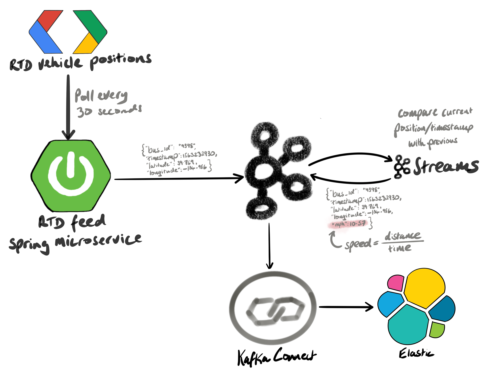
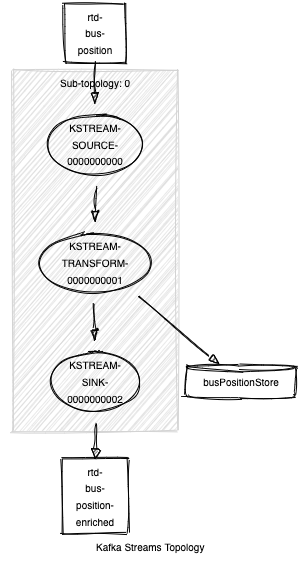
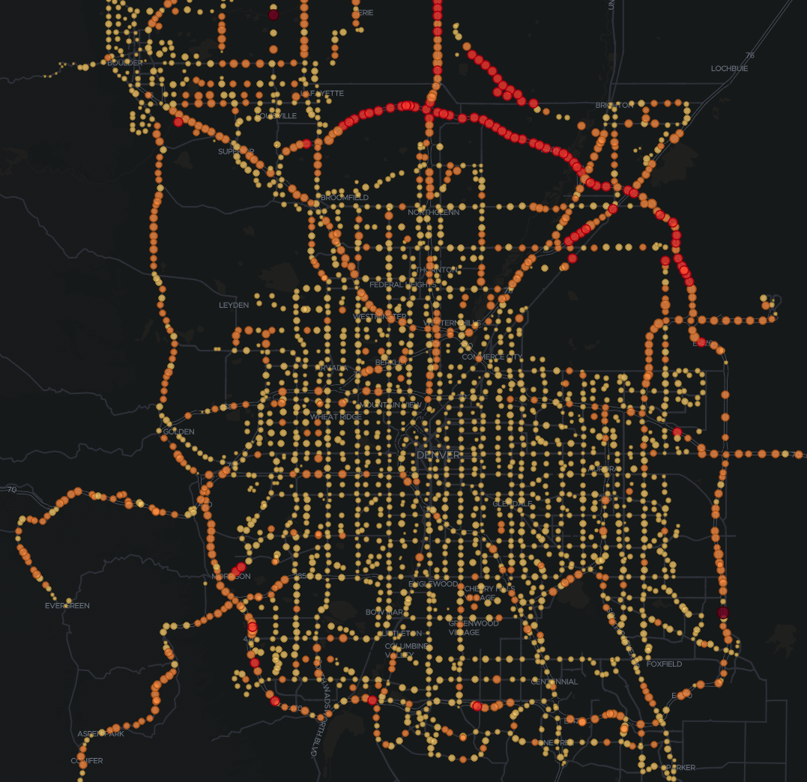

# RTD Bus Feed

The __rtd-feed__ module publishes the latest Denver RTD vehicle positions, every 30 seconds, to the `rtd-bus-position` Kafka topic.

The messages are serialized as Avro and look like this when deserialized:

    {
      "id": "985CC5EC1D3FC176E053DD4D1FAC4E39",
      "timestamp": 1574904869,
      "location": {
        "lon": -104.98970794677734,
        "lat": 39.697723388671875
      }
    }

The message key is the vehicle ID, which means that telemetry for a vehicle is always sent to the same Kafka partition.

The __rtd-stream__ module is a Kafka Streams job that enriches the feed data with the speed, based on the distance traveled between the last known position. The enriched records are written to the `rtd-bus-postition-enriched` topic. Here's a sample record:

    {
      "id": "985CC5EC1D3FC176E053DD4D1FAC4E39",
      "timestamp": 1574904869,
      "location": {
        "lon": -104.98970794677734,
        "lat": 39.697723388671875
      },
      "milesPerHour": 34.18513011763098,
      "h3": "8c268cd8d171dff"
    }

Note that the `milesPerHour` and `h3` properties have been added. The `h3` is a hierarchical spatial index, designed by Uber. See [eng.uber.com/h3](https://eng.uber.com/h3/) for more details. The `h3` is at resolution 12 - which equates to hexagons that are approx. 307 square meters.

The `rtd-stream` module reads in Kafka and Schema Registry properties from environment variables.

Once the enriched data is in Kafka, it can be written to Elastic using Kafka Connect. In order to recognise the timestamp and location using the proper datatypes, we create a dynamic template in Elastic:

    {
      "dynamic_templates": [
        {
          "dates": {
            "mapping": {
              "format": "epoch_millis",
              "type": "date"
            },
            "match": "*timestamp"
          }
        },
        {
          "locations": {
            "mapping": {
              "type": "geo_point"
            },
            "match": "*location"
          }
        }
      ]
    }

The following `curl` command was then run to create the connector:

    curl -X PUT -H "Content-Type: application/json" --data '
    {
        "connection.url": "http://elastic.woolford.io:9200",
        "connector.class": "io.confluent.connect.elasticsearch.ElasticsearchSinkConnector",
        "key.converter": "org.apache.kafka.connect.storage.StringConverter",
        "key.ignore": "true",
        "name": "rtd-elastic",
        "schema.ignore": "true",
        "topics": "rtd-bus-position-enriched",
        "transforms": "routeTS",
        "transforms.routeTS.timestamp.format": "yyyyMMdd",
        "transforms.routeTS.topic.format": "${topic}-${timestamp}",
        "transforms.routeTS.type": "org.apache.kafka.connect.transforms.TimestampRouter",
        "type.name": "_doc"
    }' http://cp01.woolford.io:8083/connectors/rtd-elastic/config

Note the [`TimestampRouter`](https://docs.confluent.io/current/connect/transforms/timestamprouter.html#timestamprouter) single-message transform. This writes the messages into new index each day. That's very handy when it comes to purging old data from Elastic.

Here's a diagram of the solution:

Here's the topology, generated by the [Kafka Streams Topology Visualizer](https://zz85.github.io/kafka-streams-viz/) tool. Note the `busPositionStore`, which is a key/value store cache of the previous bus positions. This positions are written back to a Kafka changelog topic so the state can be maintained if the streaming job was to fail:

Here's a screenshot from the Kibana dashboard:

See the feed in action:

## build/run

The Kafka and Schema Registry connection properties are read from environment variables:

| property                                  | mandatory | component         |
| :---                                      |    :----: |      ---:         |
| BOOTSTRAP_SERVERS                         | yes       | Kafka             |
| SECURITY_PROTOCOL                         | no        | Kafka             |
| SASL_JAAS_CONFIG                          | no        | Kafka             |
| SASL_ENDPOINT_IDENTIFICATION_ALGORITHM    | no        | Kafka             |
| SASL_MECHANISM                            | no        | Kafka             |       
| SCHEMA_REGISTRY_URL                       | yes       | Schema Registry   |
| BASIC_AUTH_CREDENTIALS_SOURCE             | no        | Schema Registry   |
| SCHEMA_REGISTRY_BASIC_AUTH_USER_INFO      | no        | Schema Registry   |

To create executable jars, build the project:
    
    git clone https://github.com/alexwoolford/rtd-kafka
    cd rtd-kafka
    mvn package

And then, to run `rtd-feed` and `rtd-stream`, export the environment variables:

    export BOOTSTRAP_SERVER=cp01.woolford.io:9092
    export SCHEMA_REGISTRY_URL=http://cp01.woolford.io:8081

... and then run the jars:

    java -jar rtd-feed/target/feed-0.1-spring-boot.jar
    java -jar rtd-stream/target/rtd-stream-1.0-jar-with-dependencies.jar

[//]: # ({
    "connection.url": "http://elastic.woolford.io:9200",
    "connector.class": "io.confluent.connect.elasticsearch.ElasticsearchSinkConnector",
    "key.converter": "org.apache.kafka.connect.storage.StringConverter",
    "key.ignore": "true",
    "name": "rtd-elastic",
    "schema.ignore": "true",
    "topics": "rtd-bus-position-enriched",
    "transforms": "routeTS",
    "transforms.routeTS.timestamp.format": "yyyyMMdd",
    "transforms.routeTS.topic.format": "${topic}-${timestamp}",
    "transforms.routeTS.type": "org.apache.kafka.connect.transforms.TimestampRouter",
    "type.name": "_doc"
})

[//]: # (TODO: see which fields are _always_ there and, if any of 'em are interesting, capture them in the Avro payload
id: "1606401051_1530"
vehicle {
  trip {
    trip_id: "113492947"
    schedule_relationship: SCHEDULED
    route_id: "104L"
    direction_id: 0
  }
  position {
    latitude: 39.842
    longitude: -104.74735
    bearing: 185.0
  }
  current_status: IN_TRANSIT_TO
  timestamp: 1606401020
  stop_id: "34650"
  vehicle {
    id: "1530"
    label: "1530"
  }
})

